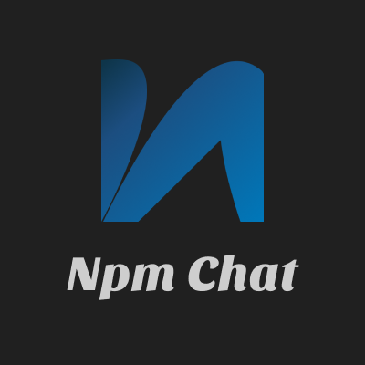

<h1 align="center">
  <br>
  
  <br>
  <br>
  Npm Chat Repository
</h1>

<div align="center">
  <a href="https://angular.dev/" target="_blank">
    
  </a>
</div>

<br>

Chatbot powered by NPM packages in your browser 🤖

See [demo](https://npm-chat.vercel.app/) 🎉

<details open="open">
<summary > <h2 style="display:inline-block">📖 Table of Contents</h2>  </summary>

- 📋 [Requirements](#requirements)
- 🔄 [Installation](#installation)
- 🚀 [Run](#run)
- 📦 [Build](#build)

</details>

## <a name="requirements"></a> 📋 Requirements

- node v20.12.0
- pnpm v9.0.6

## <a name="installation"></a> 🔄 Installation

1. Clone the repository

- ssh

```bash
git@github.com:DevJaGz/npm-chat.git
```

- https

```bash
https://github.com/DevJaGz/npm-chat.git
```

- Github CLI

```bash
gh repo clone DevJaGz/npm-chat
```

2. Install dependencies

```bash
pnpm install
```

## <a name="run"></a> 🚀 Run

Run the application in development mode

```bash
pnpm start
```

## <a name="build"></a> 📦 Build

- Production distribution

```bash
pnpm build
```
